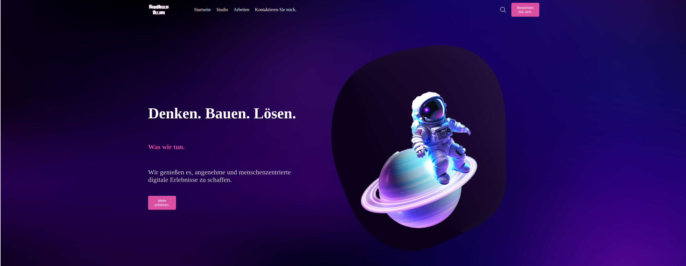

# 🌟 my-portfolio 🚀

<p align="center">
  
</p>


## 📌 Beschreibung

Ein modernes Portfolio-Projekt

Dieses Projekt wurde mit modernen Web-Technologien entwickelt und dient als persönliches Portfolio, um deine Fähigkeiten, Projekte und Kontaktinformationen stilvoll zu präsentieren.

---

## 🚀 Features

✅ **Moderne UI/UX mit Responsive Design**  
✅ **Optimiert für Geschwindigkeit und SEO**  
✅ **Dynamische Komponenten mit React**  
✅ **Einfach erweiterbar und anpassbar**  

---

## 🛠️ Technologien & Abhängigkeiten

### 📦 Hauptabhängigkeiten
- **@emailjs/browser**: ^4.4.1
- **@react-three/drei**: ^9.122.0
- **@react-three/postprocessing**: ^2.19.1
- **react**: ^18.3.1
- **react-dom**: ^18.3.1
- **react-simple-maps**: ^3.0.0
- **styled-components**: ^6.1.15
- **three**: ^0.173.0

### 🔧 Entwicklungsabhängigkeiten
- **@eslint/js**: ^9.19.0
- **@types/react**: ^19.0.8
- **@types/react-dom**: ^19.0.3
- **@vitejs/plugin-react**: ^4.3.4
- **eslint**: ^9.19.0
- **eslint-plugin-react**: ^7.37.4
- **eslint-plugin-react-hooks**: ^5.0.0
- **eslint-plugin-react-refresh**: ^0.4.18
- **globals**: ^15.14.0
- **vite**: ^6.1.0

---

## 📂 Projektstruktur

```bash
My-portfolio/
│── src/                # Quellcode des Projekts
│   ├── components/     # Wiederverwendbare UI-Komponenten
│   ├── pages/          # Seiten des Portfolios
│   ├── assets/         # Bilder, Icons, Logos, etc.
│   ├── styles/         # CSS/Tailwind/SASS Stylesheets
│── public/             # Statische Dateien und Favicon
│── package.json        # Projektkonfiguration
│── vite.config.js      # Konfiguration für Vite
│── index.html          # Haupt HTML-Datei
│── README.md           # Dokumentation des Projekts
```

---

## 🚀 Installation & Nutzung

1️⃣ **Repository klonen**  
```sh
git clone https://github.com/dein-github/my-portfolio.git
cd my-portfolio
```

2️⃣ **Abhängigkeiten installieren**  
```sh
npm install
```

3️⃣ **Entwicklung starten**  
```sh
npm run dev
```

4️⃣ **Projekt für den Live-Einsatz bauen**  
```sh
npm run build
```

---

## 🌐 Live-Demo

👉 **[Hier klicken, um die Live-Version anzusehen](https://my-portfolio-cti5.onrender.com)**

---

## 📧 Kontakt

📩 **E-Mail:** Alirezarezairad  
💼 **LinkedIn:** [Dein LinkedIn-Profil](https://linkedin.com/in/Alirezarezairad)  
🐙 **GitHub:** [Dein GitHub-Profil](https://github.com/Alirezarezairad)  

---

**📝 Lizenz**  
Dieses Projekt ist unter der MIT-Lizenz veröffentlicht. Siehe [LICENSE](LICENSE) für Details.

---

⭐️ **Vergiss nicht, das Repository zu ⭐starren, wenn dir das Projekt gefällt!** 🚀
